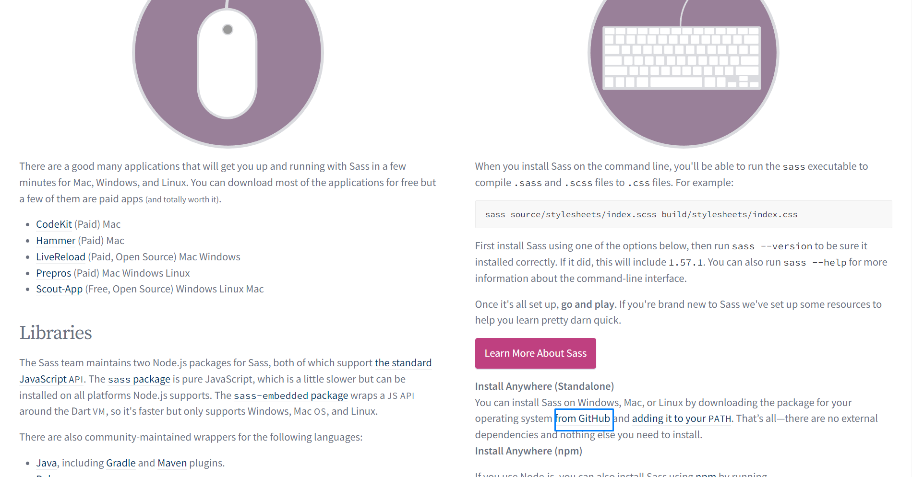
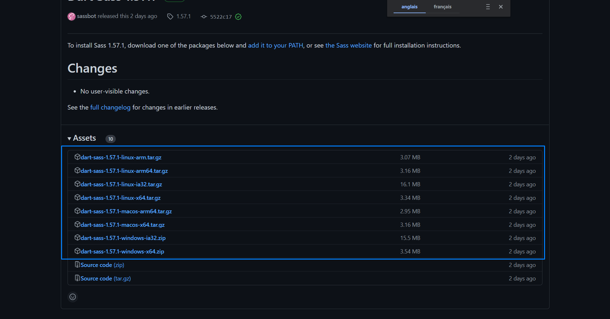
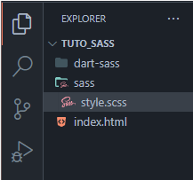
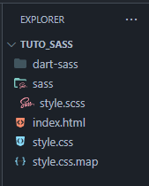
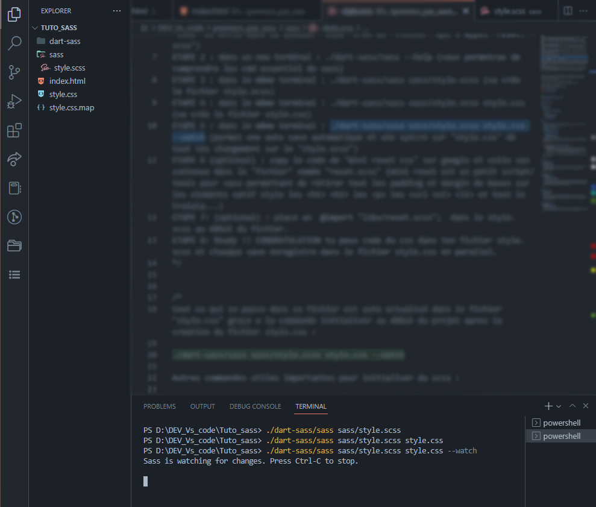

<div align="center">

[](https://colab.research.google.com/github/Naereen/badges)
[](https://github.com/Naereen/StrapDown.js/blob/master/LICENSE)
](https://GitHub.com/Naereen/StrapDown.js/graphs/commit-activity)

<br>
<br>
<br>
[](https://GitHub.com/Naereen/)
[](http://ForTheBadge.com)


  <h1> ⭐SASS/SCSS INSTALLATION LOCALE FR  </h1>

  <samp>
   <h6>Ceci est mon tout premier tuto ✌️ destiné initialement à des camarades de promotion en développement web Simplon, soyez indulgent avec ce travail
   et n'hésitez pas à me faire remonter tous les bugs rencontrer ou des axes d'améliorations potentielles. 💕 </h6>
   </samp
   
   <br>
   <br>
   <br>
    
  Dans ce tutoriel nous allons apprendre à installer le préprocesseur *SASS* en version locale sans passé par *Npm*. Sass va nous permettre de rédiger du     *CSS* de manière plus organiser et plus propre. On retrouve actuellement *SASS* sur bons nombres de projet web, car son efficacité n'est plus à prouver. Une fois Sass en votre possesions vous aurez à intégré toutes ces notions en travaillant avec quelques fonctionnalités performantes de *Sass* telles que : les *variables, les fonctions, les conditions, les mixins et les extensions*. 

  <h3> START HERE </h3>

  <br>
  <br>

  **I.** Pour la première étape, vous allez vous rendre sur <b>le site officiel de SASS</b> et vous rendre dans la section <b>"Install"</b>. <br>
    [SASS Site Officiel](https://sass-lang.com/")
  <br>
  <br>

  

  <br>
  <br>
  <br>
 
  **II.** Une fois sur la page "Install", vous devez click sur <b>"From Github"</b> dans la partit installation dite en <b>"Command Line"</b>. <br>
    [SASS Install section](https://sass-lang.com/install)

  <br>
  <br>
  <br>



  <br>
  <br>
  <br>

  **III.** Une fois sur la page de téléchargement, vous devrez choisir <b>la version correspondante a votre systeme</b>, dans mon cas Windows x64.

  <br>
  <br>
  <br>

  

  <br>
  <br>
  <br>

  **IV.** Une fois l'archive winrar <em>"dart-sass-1.XX.X"</em> en votre possession, vous trouverez a l'intérieur de cette archive un <em>"dossier"</em> nommée <em>"dart-sass"</em>. 
  Il faudra alors prendre et placer ce <em>"dossier" "dart-sass"</em> dans votre <em>"dossier"</em> de travail à l'endroit ou vous allez commencer a codé votre projet, 
  dans mon cas un dossier <em>"Tuto_sass"</em>.

  <br>
  <br>
  <br>

   
  

  <br>
  <br>
  <br>
  
  **V.**  Une fois dans mon dossier *"Tuto_sass"*, avec à l'intérieur mon dossier *"dart-sass"*. 
    Je vais créer un autre dossier dans *"Tuto_sass"* que je vais appeler *"sass"*. 
    Dans ce dossier "sass" je viens crée un *"fichier"* qui se nomme *"style.scss"*. 
    Voici a quoi doit ressembler à ce stade votre arborescence de projet.

  <br>
  <br>
  <br>

  

  <br>
  <br>
  <br>

  **VI.** à ce moment-là vous aller ouvrir un nouveau *terminal dans mon cas VSCode,* et taper dans ce terminal : <br> 
 ``` ./dart-sass/sass sass/style.scss ``` 
 <br>
  Cette commande va indiquer a *Sass* que nous travaillons dans le fichier *"style.scss"*.

  <br>
  <br>
  <br>

  

  <br>
  <br>
  <br>

  **VII.** Toujours dans ce même terminal vous allez ensuite taper : <br> 
  ``` ./dart-sass/sass sass/style.scss style.css ``` 
 <br>
  Cette commande va ainsi crée un fichier "style.css" ainsi qu'un "style.css.map" c'est normal. 

  <br>
  <br>
  <br>

  
  

  <br>
  <br>
  <br>

  **VIII.** Pour finir avec le terminal, il vous faudra taper cette dernière commande : <br> 
 ``` ./dart-sass/sass sass/style.scss style.css --watch ```
 <br>
  Qui va permettre à *Sass* d'auto save et de *syncroniser* toutes vos modifications sur *"style.scss"* directement et en parralel dans le fichier *"style.css"*.

  <br>
  <br>
  <br>

  

  <br>
  <br>
  <br>

   Pensez bien a créer un fichier *index.html* et y link votre fichier *style.css* dedans.<br>
   Avec le classique : 
  ``` <link rel="stylesheet" href="style.css"> ```
 <br>
 <br>
 <br>
 <br>
 
  <samp>
  <h6> Voila vous êtes enfin prêt a codé avec *Sass* dans votre fichier "style.scss". 😎 :star: <br>
  Ah ouais t'es chaud! Ca rigole pas ici, bababababa!
  Génie sérieux! </h6>

  [](https://GitHub.com/Naereen/ama) 
  [](https://GitHub.com/KurumiRockbell/Sass_instalation_tuto_fr)
  </samp>
</div>
